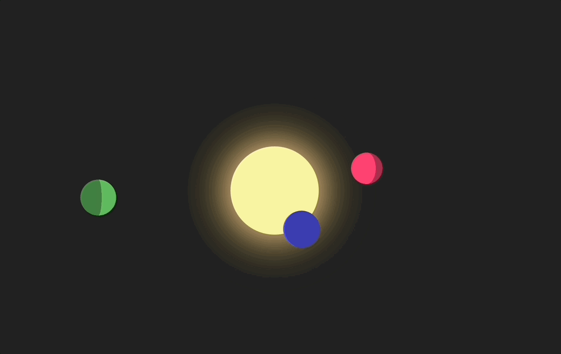

# Rotating Planets

## Description

YouTube Channel 'bite-size' course from Ania Kubow.

I have embarked on this journey to enhance my CSS animation skills.

## Key Learnings

- CSS Animation
- Difficult course at first, however after repeating it and analyzing the code, everything made more sense

## Rotating Planets Demo

The following animation shows the final outcome:

# Getting Started

Click on this link to open [Rotating Planets](https://cyberrie.github.io/rotatingPlanets/)

# Resources

This is the [link](https://www.youtube.com/watch?v=6M-rZIukXy0)to YouTube Channel course.
